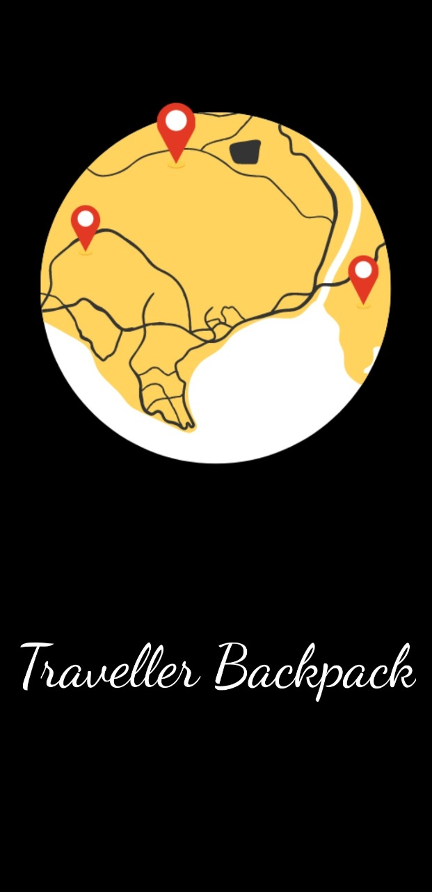
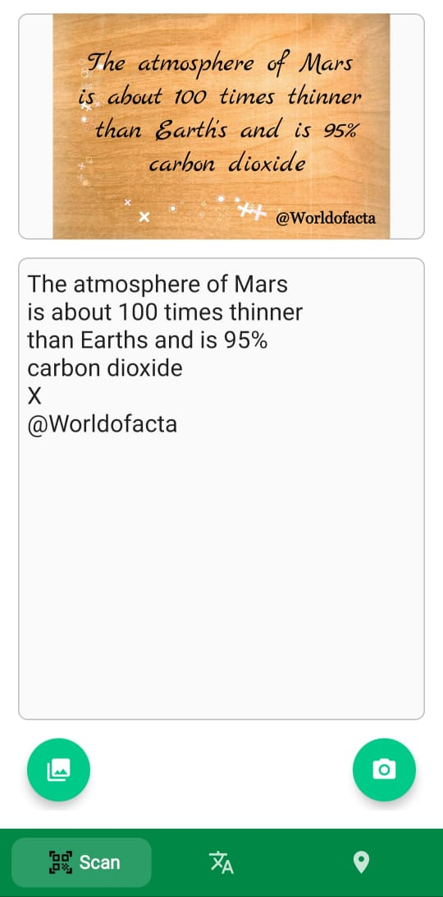
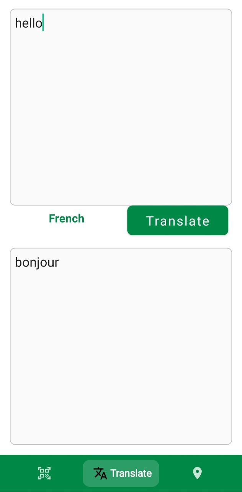
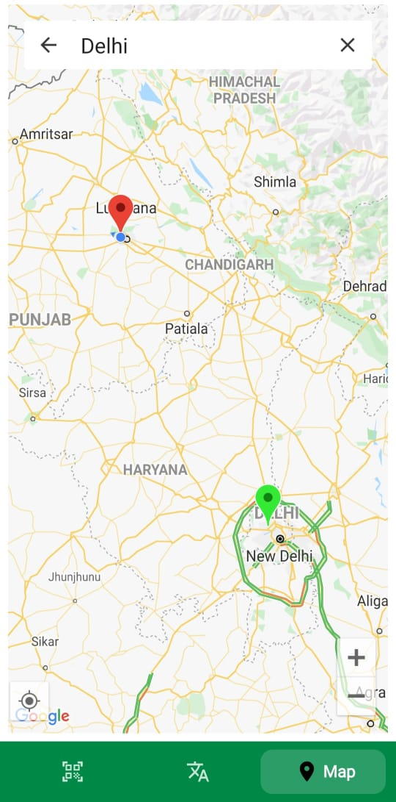

# Traveller_Backpack

App name is "Traveller Backpack". Basic Idea of this app is to help the tourists to feel comfortable in foreign land by helping them to easily communicate with people by scanning the images and getting the text on them and further translate them in the desired language(by default it is set to French). I also added map feature in which we can search for any place. This app works without any internet connection too.

Concepts Implemented:- 
1. Bottom Navigation Bar
2. View Pager 2
3. Splash screen
4. Firebase ML Kit
5. Designing of views
6. Fragments

Here are the glimpse of the UI of the app:-

<h4>Splash Screen</h4>

  

<h4>Scan Image</h4>

  

<h4>Translate Text</h4>

  

<h4>Google Maps</h4>

  
